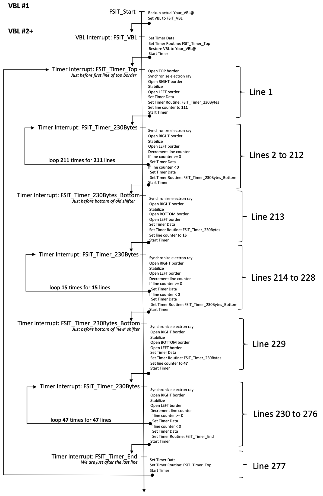

# \_FS\_IT

Authors: RATI & Janek\
Crew: Overlanders\
Date: 25/09/2016

## FullScreen in Interrupt

This technique has been invented by Ziggy Stardust of Overlanders in 1991 and first used in the OVR screen in the "Froggies Over The Fence" demo.

This is our remake of this very innovative technique. It is by far the more complex one but really convenient when you want to execute a code with that is unpredictable in terms of CPU consumption: eg. using 'mul' or 'div'.

### Sequences

In the diagram below, line 1 corresponds to the first line for which an electron ray is there. It means that in case top border is broken line 1 corresponds to line 34 of the screen.

It all stands in the synchronization done at each line. The synchronization trick is the following:

* Let's assume our image starts at memory address $2000
* Line 2 will be at $20E6
* Line 3 will be at $21CC
* Line 4 will be at $22B2
* Line 5 will be at $2398
* ...

If we always want to synchronize at the exact same vertical position we note that **the lower byte will always be $1A lower than the previous line** ($E6-$CC=$1A, $CC-$B2=$1A, $B2-$98=$1A) so once we have identified the first synchronization value based on the address where the image starts we only have to change the synchronization value by subtracting $1A to each once per line.

The diagram below depicts exactly what the code is doing:

## Usage

Follow the following steps:

* Include "FSIT.S" in your main source file
* Set TIMER\_MFP to timer you want to use: $A for Timer A, $B for Timer B, $C for Timer C, $D for Timer D
* In case nothing is specified, TIMER\_A is used
* jsr FSIT\_Start to start the fullscreen
* jsr FSIT\_Stop to stop the fullscreen
* Before a long instruction put a "stop #$2300": that will give you 172 cycles to do what you want (even multiple mulu,div,movem...)
* Stop #$2300 halts the program till an interruption above level 3 occurs (VBL or MFP) and so you don't disturb interrupt fullscreen as MFP is level 6
* It remains around 64000 cycles for the main routine (\_Main\_Prg) in the VBL meaning that this fullscreen consumes 60% of the VBL
